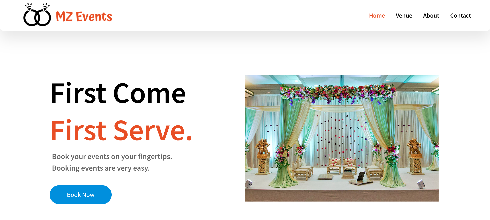

# MZ Events — Wedding Hall Booking System

A simple, static-first wedding hall booking website with a PHP booking form backed by MySQL. Users can browse venues and submit a booking request that is saved to the database.

## Features

- Responsive frontend with smooth scroll animations (AOS)
- Pages: Home, Venue, About, Contact, Registration Complete
- Booking form (`scripts/booknow.php`) that inserts submissions into MySQL
- Organized assets (`assets/css`, `assets/images`, `assets/js`)

## Tech Stack

- **Frontend**: HTML5, CSS3, Vanilla JS, [AOS](https://michalsnik.github.io/aos/)
- **Backend**: PHP 8+
- **Database**: MySQL/MariaDB

## Project Structure
```bash
mz_events/
├── assets/
│ ├── css/
│ │ ├── main.css
│ │ ├── about.css
│ │ ├── booknow.css
│ │ ├── contact.css
│ │ ├── regcomplete.css
│ │ └── venue.css
│ ├── images/ # site images (logo, venue images, etc.)
│ └── js/
│ └── main.js # AOS initialization
├── pages/
│ ├── about.html
│ ├── contact.html
│ ├── regcomplete.html
│ └── venue.html
├── scripts/
│ └── booknow.php # booking form handler (inserts into DB)
├── index.html # homepage
├── LICENSE
└── README.md
```

## Live Demo
[](https://zubairkhatti.github.io/mz_events/)

👉 Visit the website: [mz_events](https://zubairkhatti.github.io/mz_events/)

## Getting Started (Local)

### Prerequisites
- PHP 8+ (`php -v`)
- MySQL/MariaDB (`mysql --version`)
- Linux/macOS/WSL recommended

### 1) Database Setup

Start MySQL and create the database and table:

```sql
CREATE DATABASE IF NOT EXISTS registration CHARACTER SET utf8mb4 COLLATE utf8mb4_unicode_ci;
USE registration;

CREATE TABLE IF NOT EXISTS costumer (
  id INT AUTO_INCREMENT PRIMARY KEY,
  firstname VARCHAR(100) NOT NULL,
  lastname VARCHAR(100) NOT NULL,
  phoneno VARCHAR(50) NOT NULL,
  venue VARCHAR(150) NOT NULL,
  event VARCHAR(150) NOT NULL,
  date DATE NOT NULL,
  time VARCHAR(20) NOT NULL,
  quantity VARCHAR(50) NOT NULL,
  created_at TIMESTAMP DEFAULT CURRENT_TIMESTAMP
);
```

### 2) Configure PHP DB Credentials (if needed)

Open `scripts/booknow.php` and verify:
```php
$servername = "localhost";
$username   = "root";
$password   = "";             // set your MySQL password if applicable
$dbname     = "registration";
```

Optionally, create a dedicated user instead of using `root`.

### 3) Run the Dev Server

From the project root:
```bash
php -S 127.0.0.1:8000 -t .
```

### 4) Open in browser
- Home: http://127.0.0.1:8000/index.html  
- Click “Book Now” to submit a booking.
On successful submission, you’ll be redirected to `pages/regcomplete.html`.

## License

This project is licensed under the terms of the license in [LICENSE](LICENSE).